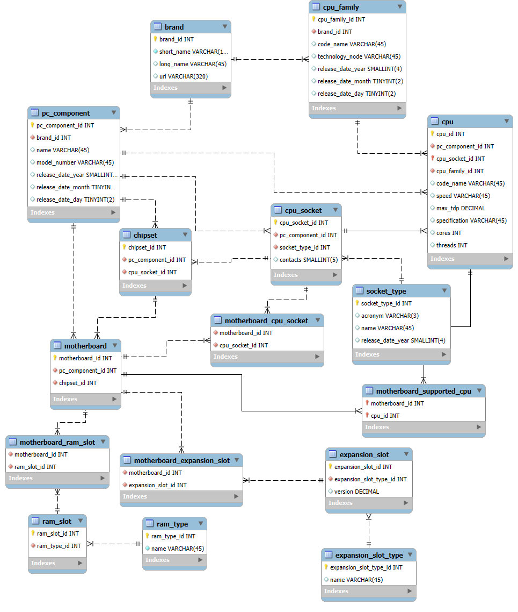

# pc-hardware-catalog-mysql-database
Database model representing a catalog of personal computer hardware.

This repo contains the pc_hardware_catalog database data model design along with any scripts.

The pc_hardware_catalog database is a catalog about any pc hardware that is known to be on premise, down to the level of a unique model number.  

This database is designed this way to support the pc_hardware_inventory database where an inventory is kept of how many of each pc_component there are and how they are allocated, right down to serial number and/or asset number of each.

